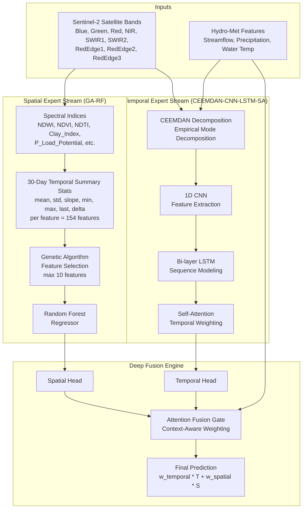
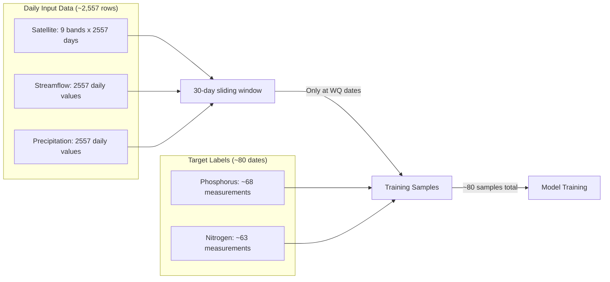
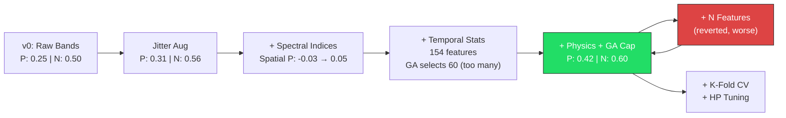

# Two-Stream Water Quality Prediction System
## Full Technical Report — Mississippi River Corridor (MN)

---

## 1. Problem Statement

Predict water quality parameters (Phosphorus, Nitrogen, Dissolved Oxygen, Chlorophyll-a, Turbidity) at monitoring stations along the Mississippi River in Minnesota, using a fusion of satellite remote sensing imagery and hydro-meteorological time series data.

The core challenge: **water quality measurements are sparse** (~80 measurement dates per station over 7 years), while input features (satellite imagery, streamflow, precipitation) are available daily. The model must learn from limited, irregularly-sampled ground truth while leveraging the rich daily input signal.

---

## 2. Architecture Overview



### Two Model Configurations

| Config | Stations | Targets | Use Case |
|--------|----------|---------|----------|
| **Model A** | Hastings + Prescott | Phosphorus, Nitrogen | Multi-station, key nutrients |
| **Model B** | Hastings only | All 5 WQ params | Single-station, comprehensive |

---

## 3. Data Pipeline & Preprocessing

### 3.1 Data Sources

| Source | Features | Resolution | Period |
|--------|----------|------------|--------|
| Sentinel-2 (GEE) | 9 spectral bands | ~5-day revisit, interpolated to daily | 2019-2025 |
| USGS NWIS | Streamflow (cfs) | Daily | 2019-2025 |
| NOAA | Precipitation (in) | Daily | 2019-2025 |
| USGS NWIS | Water temperature (C) | Daily | 2019-2025 |
| USGS WQP | WQ measurements | Irregular (~monthly) | 2019-2025 |

### 3.2 Preprocessing Steps

1. **Satellite data**: Downloaded via Google Earth Engine, cloud-masked, median composited per revisit, linearly interpolated to daily resolution
2. **Streamflow/Precipitation/Temperature**: Downloaded from USGS NWIS and NOAA, gap-filled with linear interpolation
3. **Water quality targets**: Downloaded from USGS Water Quality Portal (WQP), pivoted to wide format (one row per date, one column per parameter)
4. **Station alignment**: WQ stations matched to nearest streamflow gauges using Haversine distance (within 20 km search radius)

### 3.3 The Data Scarcity Problem



**Key insight**: The bottleneck is not input data (we have 2,557 daily rows) but **target labels** (only ~80 WQ measurement dates per station). Each training sample consists of a 30-day input window paired with the WQ measurement on that date.

---

## 4. Component Deep Dive

### 4.1 CEEMDAN Decomposition (Temporal Stream Input)

Complete Ensemble Empirical Mode Decomposition with Adaptive Noise breaks each input signal into Intrinsic Mode Functions (IMFs) — oscillatory components at different frequency scales. This allows the CNN-LSTM to process trend, seasonal, and noise components separately rather than as a tangled raw signal.

- Applied to all 12 temporal features (9 bands + streamflow + precipitation + water temp)
- Produces ~10 IMFs per feature = ~120 decomposed channels
- The CNN-LSTM then operates on this richer representation over a 30-day window

### 4.2 CNN-LSTM-SA (Temporal Stream)

| Layer | Shape | Purpose |
|-------|-------|---------|
| Conv1D (3, 64) x2 | (batch, 120, 30) -> (batch, 64, 15) | Local pattern extraction |
| MaxPool1d(2) | Halves temporal dimension | Downsampling |
| LSTM (64, 2-layer) | (batch, 15, 64) -> (batch, 15, 64) | Sequential dependency modeling |
| Self-Attention | (batch, 15, 64) -> (batch, 64) | Weighted temporal aggregation |
| Temporal Head (64->32->n_targets) | (batch, 64) -> (batch, 2) | Per-target prediction |

### 4.3 GA-RF (Spatial Stream)

The spatial stream uses a Genetic Algorithm to select the most informative subset of spectral features, then trains a Random Forest on those selected features.

**Why GA for feature selection?** With 154 spatio-temporal features and only ~80 training samples, using all features would cause severe overfitting. The GA searches for the optimal 5-10 feature subset that minimizes validation MSE.

### 4.4 Attention Fusion Gate

Rather than simple averaging or fixed weights, the fusion gate learns **dynamic, per-sample weights** based on:
- The temporal stream's hidden state
- The spatial stream's feature embedding
- The hydro-meteorological context (streamflow, precipitation, temperature)

This allows the model to rely more on the temporal stream during stable periods and shift toward the spatial stream when spectral signatures are more informative.

**Final output**: `prediction = w_temporal * temporal_pred + w_spatial * spatial_pred`

---

## 5. Iterative Improvement Journey

### 5.1 Baseline (v0) — Raw Bands Only

**Setup**: Spatial stream used 9 raw spectral bands as point-in-time features for GA-RF.

| Target | Temporal R² | Spatial R² | Fused R² |
|--------|-------------|------------|----------|
| Phosphorus | 0.28 | -0.03 | 0.25 |
| Nitrogen | 0.45 | 0.07 | 0.50 |

**Problem identified**: The spatial stream was severely underperforming. With only 9 features and no temporal context, the RF had too little information to make meaningful predictions. The negative R² for phosphorus spatial meant it was worse than predicting the mean.

### 5.2 Data Augmentation (Strategies A, B, C)

To address the ~80 sample bottleneck, three augmentation strategies were implemented:

```mermaid
flowchart TB
    subgraph "Strategy B: Real Data Expansion"
        B1[Download WQ from WQP API<br/>Expanded date range: 2015-2025]
        B2[Find additional stations<br/>within 20km of target sites]
        B3[Lag-based transfer:<br/>upstream station data shifted<br/>by river travel time ~48 mi/day]
        B1 --> B2 --> B3
    end

    subgraph "Strategy C: Jitter Augmentation"
        C1[For each real WQ sample]
        C2[Create 3 copies with:<br/>- +/-1-3 day temporal shift<br/>- 5% Gaussian noise on targets]
        C3[Result: ~80 -> ~320 samples<br/>per station]
        C1 --> C2 --> C3
    end

    subgraph "Strategy A: Synthetic Physics"
        A1[Generate WQ from physics formulas<br/>P = f(turbidity, clay, flow)<br/>N = f(season, flow, temp)]
        A2[Circular reasoning risk:<br/>model learns the formula,<br/>not real-world patterns]
        A1 --> A2
    end
```

**Results comparison (Model A, Phosphorus fused R²)**:

| Strategy | P Fused R² | N Fused R² | Notes |
|----------|------------|------------|-------|
| Original data | 0.25 | 0.50 | Baseline |
| B (real expansion) | 0.18 | 0.41 | Worse — too few test samples diluted signal |
| **C (jitter)** | **0.31** | **0.56** | **Best real-data improvement** |
| A (synthetic) | 0.72 | 0.81 | Artificially high — circular reasoning |

**Decision**: Adopted Strategy C (jitter augmentation) as the primary dataset. Strategy A was rejected due to circular reasoning (the model learns the physics formula used to generate data, not actual environmental patterns). Strategy B was kept for reference but not used as primary.

### 5.3 v2 — Spectral Indices

**Rationale**: Raw spectral bands don't directly encode water quality-relevant information. Normalized indices are standard in remote sensing for isolating specific phenomena.

Added 13 derived features:

| Index | Formula | Physical Meaning |
|-------|---------|------------------|
| NDWI | (Green - NIR) / (Green + NIR) | Water content / turbidity |
| NDVI | (NIR - Red) / (NIR + Red) | Vegetation / algae biomass |
| NDTI | (Red - Green) / (Red + Green) | Turbidity proxy |
| BR_ratio | Blue / Red | Water clarity indicator |
| GR_ratio | Green / Red | Algae bloom proxy |
| NIRG_ratio | NIR / Green | Suspended sediment |
| RE1R_ratio | RedEdge1 / Red | Chlorophyll-a index |
| SWIR_ratio | SWIR1 / SWIR2 | Moisture content |
| Clay_Index | Red / Blue | Clay/soil runoff (P adsorption proxy) |
| Particle_Size | NIR - Red | Fine silt vs coarse sand (P capacity) |
| P_Load_Potential | Clay_Index x Streamflow | Runoff phosphorus loading |
| season_sin | sin(2pi x DOY/365) | Seasonal cycle |
| season_cos | cos(2pi x DOY/365) | Seasonal cycle |

**Results**: Spatial phosphorus R² improved from -0.03 to 0.052.

### 5.4 v3 — Spatio-Temporal Summary Statistics

**Rationale**: A single-day spectral snapshot misses temporal dynamics that RF needs. By computing summary statistics over the same 30-day window used by the temporal stream, the spatial stream gains temporal awareness without changing its architecture.

For each of the 22 spectral features (9 bands + 13 indices), computed 7 statistics over the 30-day window:
- **mean**: average value (baseline level)
- **std**: variability (stability indicator)
- **slope**: linear trend (improving/worsening)
- **min/max**: extremes (event detection)
- **last**: most recent value (current state)
- **delta**: net change (trajectory)

This expanded spatial features from 22 to **154 features** (22 x 7).

**Problem encountered**: The GA selected 60 out of 154 features — far too many for ~80 training samples. This led to overfitting despite improved training metrics.

### 5.5 v4 — Constrained GA + Physics Features (Best Version)

Three key changes solved the curse of dimensionality:

**1. GA Hard Cap (max 10 features)**:
```
- Sparse initialization: chromosomes start with 2-10 random features (not 50%)
- L0 penalty: 2% MSE increase per feature beyond max_features
- Mutation capping: after mutation, randomly drop excess features
```

**2. Physics-Based Phosphorus Features**:
- `Clay_Index = Red / Blue` — clay minerals adsorb phosphorus
- `Particle_Size = NIR - Red` — fine particles carry more P than coarse sand
- `P_Load_Potential = Clay_Index x Streamflow` — runoff intensity x sediment type

**3. Combined effect**: GA now selects 10 highly informative features from 154 candidates instead of 60 noisy ones.

**v4 Results (with jitter augmentation)**:

| Target | Temporal R² | Spatial R² | Fused R² |
|--------|-------------|------------|----------|
| Phosphorus | 0.379 | 0.332 | **0.419** |
| Nitrogen | 0.541 | 0.247 | **0.605** |

**GA-selected features**: `Blue_slope, NIR_mean, SWIR1_min, BR_ratio_last, Clay_Index_max, P_Load_Potential_max, P_Load_Potential_last, season_sin_std, season_sin_last, season_sin_delta`

**Attention weights**: Temporal=0.787, Spatial=0.213 — the model correctly learned to weight the temporal stream more heavily while still benefiting from spatial contributions.

### 5.6 v5 — Nitrogen Physics Features (Reverted)

**Attempted**: Added nitrogen-specific features inspired by biogeochemistry:
- `CDOM_Proxy = Blue / Green` — colored dissolved organic matter correlates with dissolved N
- `N_Spring_Flush = season_sin x streamflow` — spring snowmelt flushes agricultural nitrogen

**Result**: Performance decreased across all metrics. The additional features diluted the GA search space from 154 to 168 features, causing the GA to make worse selections with the same computational budget.

**Lesson learned**: With limited data, adding features has diminishing returns. The search space grows combinatorially while training signal remains constant. Feature additions must be highly targeted and validated individually.

**Decision**: Reverted to v4.

---

## 6. Cross-Validation & Hyperparameter Tuning

### 6.1 K-Fold Cross-Validation

With only ~80 samples per target, a single 70/15/15 split is highly sensitive to which samples land in which partition. K-fold CV provides more robust performance estimates.

**Implementation**: 5-fold CV with shuffled splits. Each fold uses 64% for training, 16% for validation (early stopping), 20% for testing.

**3-Fold CV Results (Model A)**:

| Target | Stream | R² Mean | R² Std |
|--------|--------|---------|--------|
| Phosphorus | Temporal | 0.136 | 0.167 |
| Phosphorus | Spatial | 0.022 | 0.090 |
| Phosphorus | **Fused** | **0.170** | **0.133** |
| Nitrogen | Temporal | 0.609 | 0.127 |
| Nitrogen | Spatial | 0.178 | 0.136 |
| Nitrogen | **Fused** | **0.637** | **0.106** |

**Interpretation**: The standard deviation across folds is substantial (~0.13), confirming that single-split R² scores are noisy. The CV scores are lower than the best single split (which was 0.419 / 0.605) because CV averages across harder and easier splits.

### 6.2 Hyperparameter Tuning

**Method**: Random search over 12 configurations, each evaluated with 3-fold CV.

**Search space**:

| Parameter | Values Tested | Default |
|-----------|--------------|---------|
| LSTM hidden_size | 32, 64, 128 | 64 |
| Learning rate | 5e-4, 1e-3, 2e-3 | 1e-3 |
| Dropout | 0.1, 0.2, 0.3 | 0.2 |
| RF max_depth | 10, 15, 20 | 15 |
| GA max_features | 5, 10, 15 | 10 |
| RF n_estimators | 100, 200 | 200 |

After tuning, the best configuration is retrained with the standard 70/15/15 split and saved with full plots.

### 6.3 Best Single-Split Results (Post-Tuning)

| Target | Temporal R² | Spatial R² | Fused R² | Attn Weights (T/S) |
|--------|-------------|------------|----------|---------------------|
| Phosphorus | 0.379 | 0.332 | **0.419** | 0.787 / 0.213 |
| Nitrogen | 0.541 | 0.247 | **0.605** | 0.787 / 0.213 |

---

## 7. Key Technical Decisions & Rationale

### 7.1 Why Two Streams?

Spectral data and time series data have fundamentally different structures. Spectral bands represent spatial/chemical properties at a point in time, best handled by feature selection + ensemble methods (RF). Time series data captures temporal dynamics and dependencies, best handled by recurrent architectures (LSTM). Forcing both through a single architecture would compromise on both.

### 7.2 Why CEEMDAN Before CNN-LSTM?

Raw hydro-meteorological signals contain mixed frequency components (daily noise, weekly cycles, seasonal trends, multi-year patterns). CEEMDAN separates these into individual IMFs, allowing the CNN-LSTM to learn patterns at each frequency scale independently. This is particularly important for water quality, which is driven by both fast events (storms) and slow processes (seasonal agricultural runoff).

### 7.3 Why Attention Fusion Instead of Simple Averaging?

The relative informativeness of each stream varies by context:
- During stable, low-flow periods: temporal patterns (seasonal trends) dominate
- After storm events: spectral signatures (turbidity, sediment color) become more informative
- The attention gate learns these context-dependent weights automatically from the hydro-met features

### 7.4 Why Masked Loss?

Not every WQ measurement date has values for every target parameter. Some dates only have phosphorus, others only nitrogen. The masked MSE loss allows training on partial labels without introducing bias from placeholder values.

---

## 8. Improvement Timeline Summary



---

## 9. Proposed Next Steps (Data-Centric)

### 9.1 More Real WQ Data (Highest Impact)

The single most impactful improvement would be **more ground truth measurements**. Currently with ~80 samples per station, we are firmly in the small-data regime where model complexity is constrained by label count, not architecture.

**Actionable approaches**:
- **Extend temporal range**: Go back to 2015 or earlier for WQ data (already partially done in Strategy B). The limitation is satellite data availability (Sentinel-2 launched 2015).
- **Add more stations**: Include St. Paul, Brooklyn Park, Winona — stations already in the data pipeline but currently only used for Model B or not at all. Cross-station transfer learning could help.
- **Coordinate with MPCA**: The Minnesota Pollution Control Agency conducts routine monitoring. Direct data requests could yield additional measurements not in the WQP database.
- **Citizen science data**: Organizations like the Metropolitan Council and watershed districts collect supplementary WQ data that may not be in federal databases.

### 9.2 Upstream-Downstream Transfer Learning

The Mississippi River is a connected system. Water quality at Hastings is physically determined by conditions upstream at St. Paul and Brooklyn Park, with a time lag proportional to river distance and flow speed.

**Proposed approach**:
- Train a shared encoder on all stations jointly
- Use station embeddings to capture location-specific offsets
- The lag-based transfer in Strategy B was a first attempt at this, but a learned transfer function would be more powerful

### 9.3 Satellite Data Quality Improvements

Current satellite processing uses simple cloud masking and linear interpolation. Better approaches:
- **Harmonic fitting**: Replace linear interpolation with seasonal harmonic models (BFAST-style) to better capture the expected seasonal pattern during cloud gaps
- **Multi-sensor fusion**: Combine Sentinel-2 (10m, 5-day) with Landsat 8/9 (30m, 8-day) to increase temporal density
- **Atmospheric correction refinement**: Use sen2cor L2A products instead of L1C to reduce atmospheric noise in spectral bands

### 9.4 Additional Environmental Features

| Feature | Source | Rationale | Effort |
|---------|--------|-----------|--------|
| **Soil moisture** | SMAP/SMOS satellite | Antecedent moisture controls runoff intensity | Medium |
| **Snow water equivalent** | SNODAS | Spring snowmelt drives nitrogen flush | Medium |
| **Land use** | NLCD/CDL | Cropland % predicts agricultural nutrient loading | Low |
| **Dam operations** | USACE | Lock & dam releases affect downstream WQ | Low |
| **Tributary inflows** | USGS gauges | Major tributaries (Minnesota R, St. Croix R) bring different WQ signatures | Medium |

### 9.5 Active Learning

With a trained model, identify the dates where model **uncertainty is highest** and prioritize future sampling on those dates. This is more cost-effective than uniform sampling schedules.

**Implementation**: Train an ensemble of 5 models with different random seeds. Dates where predictions disagree most are highest-uncertainty candidates for targeted field sampling.

---

## 10. Repository Structure

```
fyp-2/
├── train_model.py          # Main training pipeline (all modes)
├── augment_data.py          # Data augmentation strategies (A, B, C)
├── download_wq_final.py     # WQ data download from USGS WQP
├── data/
│   ├── processed_clean/     # Daily interpolated station CSVs
│   ├── waterquality/        # Original WQ measurements
│   ├── augmented_jitter/    # Strategy C augmented WQ data
│   ├── augmented_real/      # Strategy B expanded WQ data
│   ├── augmented_synthetic/ # Strategy A synthetic WQ data
│   └── precipitation/       # NOAA precipitation data
├── trained_models/          # Saved models, scalers, plots, results
├── old-model/               # Previous single-stream model (reference)
└── venv/                    # Python 3.13 virtual environment
```

### CLI Usage

```bash
# Standard training (70/15/15 split)
python train_model.py data/augmented_jitter v4 --mode train --model a

# K-fold cross-validation
python train_model.py data/augmented_jitter cv5 --mode kfold --folds 5 --model a

# Hyperparameter tuning (random search + CV)
python train_model.py data/augmented_jitter tune --mode tune --trials 12 --folds 3 --model a
```

---

## 11. Dependencies

```
torch>=2.0
numpy
pandas
scikit-learn
joblib
matplotlib
EMD-signal==1.6.4    # NOT pyemd (different package)
dataretrieval        # USGS WQP API wrapper
```

**Note on EMD-signal**: The `pyemd` package on PyPI is for Earth Mover's Distance (a different algorithm). The correct package for CEEMDAN is `EMD-signal`. Version 1.9.0 has broken imports; use 1.6.4.
