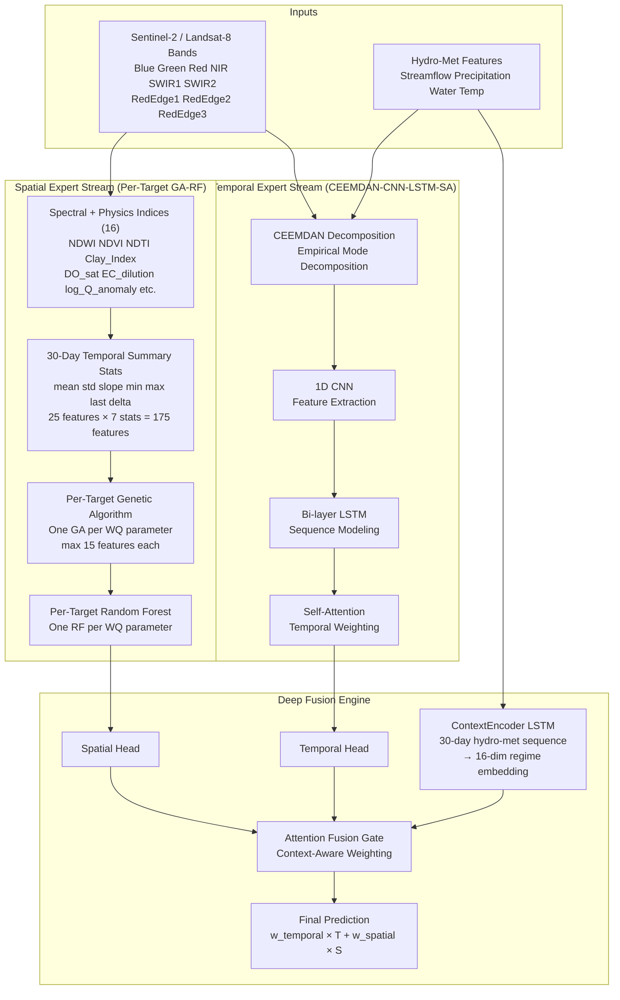
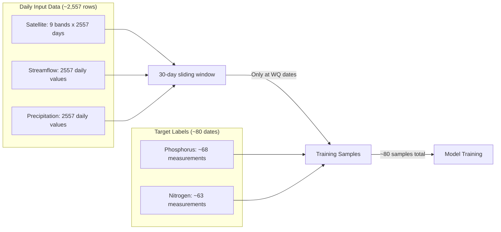
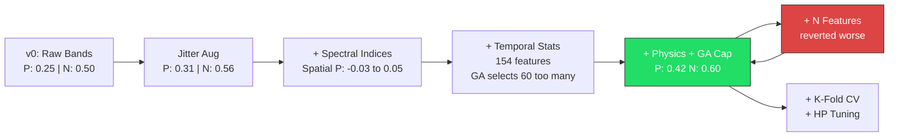

# Two-Stream Water Quality Prediction System
## Full Technical Report — Mississippi River (MN) & Danube River (Serbia)

---

## 1. Problem Statement

Predict water quality parameters at river monitoring stations using a fusion of satellite remote sensing imagery and hydro-meteorological time series data.

The system has been developed and validated on two separate river systems:
- **Mississippi River, Minnesota (USA)**: 5 USGS monitoring stations, 2019–2025. Targets: Phosphorus, Nitrogen, Dissolved Oxygen, Chlorophyll-a, Turbidity. Data is very sparse (~80 measurement dates per station over 7 years).
- **Danube River, Serbia**: 7 ICPDR monitoring stations, 2013–2023. Targets: Dissolved Oxygen, Total Phosphorus, Nitrate-N, Electrical Conductance, Chlorophyll-a. Richer temporal coverage (~125–180 measurement dates per parameter per station from GFQA_v3).

The core challenge: **water quality measurements are sparse and irregularly sampled**, while input features (satellite imagery, streamflow, precipitation) are available daily. The model must learn from limited ground truth while leveraging the rich daily input signal.

---

## 2. Architecture Overview



### Three Model Configurations

| Config | Dataset | Stations | Targets | Notes |
|--------|---------|----------|---------|-------|
| **Model A** | Mississippi | Hastings + Prescott | Phosphorus, Nitrogen | Multi-station, key nutrients |
| **Model B** | Mississippi | Hastings only | All 5 WQ params | Single-station, comprehensive |
| **Model C** | Danube | All 7 Serbian stations | DO, TP, NO3N, EC, Chl-a | Richer data; BOD excluded (no satellite signal) |

---

## 3. Data Pipeline & Preprocessing

### 3.1 Mississippi River Data Sources

| Source | Features | Resolution | Period |
|--------|----------|------------|--------|
| Sentinel-2 (GEE) | 9 spectral bands | ~5-day revisit, interpolated to daily | 2019–2025 |
| USGS NWIS | Streamflow (cfs) | Daily | 2019–2025 |
| NOAA CDO | Precipitation (in) | Daily | 2019–2025 |
| Minnesota DNR | Water temperature (°F→°C) | Daily | 2019–2025 |
| USGS WQP | WQ measurements | Irregular (~monthly) | 2019–2025 |

### 3.2 Danube River Data Sources

Seven Serbian Danube mainstem stations from the ICPDR monitoring network, data from **GFQA_v3** (Global Freshwater Quality Assessment v3).

| Station ID | Location | Km |
|------------|----------|----|
| SRB00001 | Bezdan | 1425 |
| SRB00040 | Bogojevo | 1367 |
| SRB00002 | Novi Sad | 1255 |
| SRB00003 | Zemun (Belgrade) | 1173 |
| SRB00041 | Smederevo | 1116 |
| SRB00005 | Banatska Palanka | 1077 |
| SRB00006 | Tekija (Iron Gate) | 931 |

| Source | Features | Resolution | Period |
|--------|----------|------------|--------|
| Sentinel-2 / Landsat-8 (GEE) | 9 spectral bands | ~5-day revisit, interpolated | 2012–2023 |
| ICPDR discharge.csv | Streamflow (m³/s) | Daily | 2012–2023 |
| ICPDR weather.csv | Precipitation (mm), air temp (°C) | Daily | 2012–2023 |
| GFQA_v3 | DO, TP, NO3N, EC, BOD, Chl-a | Irregular (~monthly) | 2013–2023 |

**WQ parameter mapping from GFQA_v3**:

| GFQA_v3 file | Parameter code | Model target column |
|--------------|---------------|---------------------|
| Dissolved_Gas.csv | O2-Dis | dissolved_oxygen |
| Phosphorus.csv | TP | total_phosphorus |
| Oxidized_Nitrogen.csv | NO3N | nitrate_n |
| Electrical_Conductance.csv | EC | electrical_conductance |
| Pigment.csv | Chl-a | chlorophyll_a |

**Note — BOD excluded**: Biochemical oxygen demand (from Oxygen_Demand.csv) was included in early experiments but removed because it has no meaningful satellite spectral signal. The GA consistently selected non-informative features for this target, producing negative R² scores. Keeping it degraded training for the other parameters by consuming model capacity and distorting shared loss gradients.

**Satellite pre-processing for Danube**:
1. DOY date encoding bug: GEE exported dates like `2013-04-118` where `118` is the day-of-year, not the day. Fixed by detecting `parts[2] > 31` and converting via `datetime(year, 1, 1) + timedelta(days=doy-1)`.
2. Landsat 8 RedEdge bands: L8 has no RedEdge sensors — these were encoded as `-9999` sentinel values. Replaced with `NaN` before linear interpolation from Sentinel-2 observations.

### 3.3 Preprocessing Steps

1. **Satellite data**: Downloaded via Google Earth Engine, cloud-masked, median composited per revisit, DOY-encoded dates fixed, linearly interpolated to daily resolution
2. **Streamflow/Precipitation/Temperature**: Downloaded from USGS NWIS and NOAA (Mississippi) or ICPDR CSVs (Danube), gap-filled with linear interpolation; precipitation gaps filled with 0
3. **Water quality targets**: USGS WQP format (Mississippi) or GFQA_v3 per-parameter CSVs (Danube), pivoted to wide format with one column per parameter
4. **Station alignment**: WQ stations matched to nearest streamflow gauges using Haversine distance (within 20 km search radius)
5. **Danube augmentation**: Strategy C jitter augmentation applied to per-parameter CSVs — 3 copies per real measurement with 1–3 day temporal shift and 5% Gaussian noise. Originals tagged `source="original"`, copies tagged `source="augmented_copy{i}_jitter{d}d"`.

### 3.4 The Data Scarcity Problem



**Key insight**: The bottleneck is not input data (we have 2,557 daily rows) but **target labels** (only ~80 WQ measurement dates per station). Each training sample consists of a 30-day input window paired with the WQ measurement on that date.

---

## 4. Component Deep Dive

### 4.1 CEEMDAN Decomposition (Temporal Stream Input)

Complete Ensemble Empirical Mode Decomposition with Adaptive Noise breaks each input signal into Intrinsic Mode Functions (IMFs) — oscillatory components at different frequency scales. This allows the CNN-LSTM to process trend, seasonal, and noise components separately rather than as a tangled raw signal.

- Applied to all 12 temporal features (9 bands + streamflow + precipitation + water temp)
- Produces ~10 IMFs per feature = ~120 decomposed channels
- The CNN-LSTM then operates on this richer representation over a 30-day window

### 4.2 CNN-LSTM-SA (Temporal Stream)

| Layer | Shape | Purpose |
|-------|-------|---------|
| Conv1D (3, 64) x2 | (batch, 120, 30) -> (batch, 64, 15) | Local pattern extraction |
| MaxPool1d(2) | Halves temporal dimension | Downsampling |
| LSTM (64, 2-layer) | (batch, 15, 64) -> (batch, 15, 64) | Sequential dependency modeling |
| Self-Attention | (batch, 15, 64) -> (batch, 64) | Weighted temporal aggregation |
| Temporal Head (64->32->n_targets) | (batch, 64) -> (batch, 2) | Per-target prediction |

### 4.3 GA-RF (Spatial Stream — Per-Target)

The spatial stream uses a **separate** Genetic Algorithm and Random Forest for each WQ target parameter.

**Why per-target?** The original design used a single GA with fitness computed as the mean of all targets. This was structurally flawed: the spectral features useful for DO (water-column oxygenation, linked to temperature and NDVI) are completely different from those useful for NO3N (land runoff events, linked to Clay_Index and streamflow anomaly). Averaging targets forced the GA to find a mediocre compromise rather than optimal features for each parameter.

**Current design**:
- One `GeneticAlgorithmFeatureSelector` per target, trained with that target's own measurement mask
- Rows where a target is not measured on a given date are excluded from that target's GA and RF — no imputation bias
- Feature cap: **max 15 features per target** (increased from 10 — justified because each target now has its own selection budget rather than sharing a pool)
- One `RandomForestRegressor` per target, trained on target-specific masked rows

**Feature space**: 25 base features (9 spectral bands + 16 spectral/physics indices) × 7 temporal statistics = **175 total candidate features** per target.

**Why 15 and not 30?** With ~100–150 training samples per target after augmentation, 15 features gives a comfortable 7–10× sample-to-feature ratio for the RF. Going to 30 risks overfitting; staying at 10 was too conservative for per-target selection.

### 4.4 Physics-Informed Spatial Features

Three new physics-derived features added to the spatial feature set (in addition to the previously existing 13 spectral indices):

| Feature | Formula | Physical Rationale |
|---------|---------|-------------------|
| `DO_sat` | `exp(7.7117 − 1.31403 × ln(T+45.93))` | Garcia-Gordon saturation DO at measured water temperature — the physical upper bound. The gap between saturation and actual DO is directly related to biological oxygen demand and eutrophication. |
| `EC_dilution` | `median_Q / (Q + ε)` | Electrical conductance behaves as a conservative tracer: when flow rises, dissolved salts are diluted proportionally. This feature encodes the expected inverse relationship between discharge and EC. |
| `log_Q_anomaly` | `log(Q+1) − log(Q_30d_mean+1)` | Log-scale deviation from recent mean flow. Positive values = flood pulse (high nutrient loading); negative = low-flow concentration events. Key signal for both TP and NO3N. |

### 4.5 Attention Fusion Gate with ContextEncoder LSTM

**Previous design**: The fusion gate received a 3-dimensional scalar vector — today's streamflow, precipitation, and water temperature — to decide how to weight the two streams.

**Problem**: A single day's conditions carry little information about the hydrological regime. Whether flow is currently 300 m³/s means very different things at the end of a 2-week flood vs. the start of a summer low-flow period.

**New design**: A `ContextEncoder` LSTM processes the full **30-day hydro-met sequence** (the same window used for temporal feature extraction) and compresses it into a 16-dimensional regime embedding. The fusion gate then conditions its weighting decision on this richer context.

```
HM sequence (30×3) → LSTM(input=3, hidden=16) → context_emb (16)
context_emb → AttentionFusionGate → (w_temporal, w_spatial)
```

This allows the gate to distinguish, for example, between:
- **Spring melt regime**: Rising flow + cold temperature → spatial (turbidity/sediment plume) more informative
- **Summer stable regime**: Steady low flow + warm temperature → temporal (algal growth trend) more informative

**Final output**: `prediction = w_temporal × temporal_pred + w_spatial × spatial_pred`

### 4.6 Z-Score Target Normalisation (StandardScaler)

**Problem**: The previous `MinMaxScaler` for targets caused the loss to be dominated by whichever target had the largest absolute range. For the Danube model, electrical conductance (EC) ranges ~200–800 µS/cm while total phosphorus ranges ~0.05–1.0 mg/L — a 500× scale difference. Even with masked loss, the gradient was dominated by EC regardless of which targets actually mattered.

**Fix**: Targets are now scaled to **z-scores** using `StandardScaler` (mean=0, std=1 per target, fit on training data only using masked real values). In the scaled loss space, every target contributes equally to the gradient regardless of its physical unit or measurement range. Predictions are inverse-transformed back to physical units for evaluation and plotting.

---

## 5. Iterative Improvement Journey

### 5.1 Baseline (v0) — Raw Bands Only

**Setup**: Spatial stream used 9 raw spectral bands as point-in-time features for GA-RF.

| Target | Temporal R² | Spatial R² | Fused R² |
|--------|-------------|------------|----------|
| Phosphorus | 0.28 | -0.03 | 0.25 |
| Nitrogen | 0.45 | 0.07 | 0.50 |

**Problem identified**: The spatial stream was severely underperforming. With only 9 features and no temporal context, the RF had too little information to make meaningful predictions. The negative R² for phosphorus spatial meant it was worse than predicting the mean.

### 5.2 Data Augmentation (Strategies A, B, C)

To address the ~80 sample bottleneck, three augmentation strategies were implemented:

```mermaid
flowchart LR
    subgraph "Strategy B: Real Data Expansion"
        direction LR
        B1[Download WQ from WQP API<br/>Expanded date range: 2015-2025] --> B2[Find additional stations<br/>within 20km of target sites] --> B3["Lag-based transfer:<br/>upstream station data shifted<br/>by river travel time ~48 mi/day"]
    end

    subgraph "Strategy C: Jitter Augmentation"
        direction LR
        C1[For each real WQ sample] --> C2["Create 3 copies with:<br/>- 1-3 day temporal shift<br/>- 5% Gaussian noise on targets"] --> C3["Result: ~80 to ~320 samples<br/>per station"]
    end

    subgraph "Strategy A: Synthetic Physics"
        direction LR
        A1["Generate WQ from physics formulas<br/>P = f&#40;turbidity clay flow&#41;<br/>N = f&#40;season flow temp&#41;"] --> A2["Circular reasoning risk:<br/>model learns the formula<br/>not real-world patterns"]
    end
```



**Results comparison (Model A, Phosphorus fused R²)**:

| Strategy | P Fused R² | N Fused R² | Notes |
|----------|------------|------------|-------|
| Original data | 0.25 | 0.50 | Baseline |
| B (real expansion) | 0.18 | 0.41 | Worse — too few test samples diluted signal |
| **C (jitter)** | **0.31** | **0.56** | **Best real-data improvement** |
| A (synthetic) | 0.72 | 0.81 | Artificially high — circular reasoning |

**Decision**: Adopted Strategy C (jitter augmentation) as the primary dataset. Strategy A was rejected due to circular reasoning (the model learns the physics formula used to generate data, not actual environmental patterns). Strategy B was kept for reference but not used as primary.

### 5.3 v2 — Spectral Indices

**Rationale**: Raw spectral bands don't directly encode water quality-relevant information. Normalized indices are standard in remote sensing for isolating specific phenomena.

Added 13 derived features:

| Index | Formula | Physical Meaning |
|-------|---------|------------------|
| NDWI | (Green - NIR) / (Green + NIR) | Water content / turbidity |
| NDVI | (NIR - Red) / (NIR + Red) | Vegetation / algae biomass |
| NDTI | (Red - Green) / (Red + Green) | Turbidity proxy |
| BR_ratio | Blue / Red | Water clarity indicator |
| GR_ratio | Green / Red | Algae bloom proxy |
| NIRG_ratio | NIR / Green | Suspended sediment |
| RE1R_ratio | RedEdge1 / Red | Chlorophyll-a index |
| SWIR_ratio | SWIR1 / SWIR2 | Moisture content |
| Clay_Index | Red / Blue | Clay/soil runoff (P adsorption proxy) |
| Particle_Size | NIR - Red | Fine silt vs coarse sand (P capacity) |
| P_Load_Potential | Clay_Index x Streamflow | Runoff phosphorus loading |
| season_sin | sin(2pi x DOY/365) | Seasonal cycle |
| season_cos | cos(2pi x DOY/365) | Seasonal cycle |

**Results**: Spatial phosphorus R² improved from -0.03 to 0.052.

### 5.4 v3 — Spatio-Temporal Summary Statistics

**Rationale**: A single-day spectral snapshot misses temporal dynamics that RF needs. By computing summary statistics over the same 30-day window used by the temporal stream, the spatial stream gains temporal awareness without changing its architecture.

For each of the 22 spectral features (9 bands + 13 indices), computed 7 statistics over the 30-day window:
- **mean**: average value (baseline level)
- **std**: variability (stability indicator)
- **slope**: linear trend (improving/worsening)
- **min/max**: extremes (event detection)
- **last**: most recent value (current state)
- **delta**: net change (trajectory)

This expanded spatial features from 22 to **154 features** (22 x 7).

**Problem encountered**: The GA selected 60 out of 154 features — far too many for ~80 training samples. This led to overfitting despite improved training metrics.

### 5.5 v4 — Constrained GA + Physics Features (Best Version)

Three key changes solved the curse of dimensionality:

**1. GA Hard Cap (max 10 features)**:
```
- Sparse initialization: chromosomes start with 2-10 random features (not 50%)
- L0 penalty: 2% MSE increase per feature beyond max_features
- Mutation capping: after mutation, randomly drop excess features
```

**2. Physics-Based Phosphorus Features**:
- `Clay_Index = Red / Blue` — clay minerals adsorb phosphorus
- `Particle_Size = NIR - Red` — fine particles carry more P than coarse sand
- `P_Load_Potential = Clay_Index x Streamflow` — runoff intensity x sediment type

**3. Combined effect**: GA now selects 10 highly informative features from 154 candidates instead of 60 noisy ones.

**v4 Results (with jitter augmentation)**:

| Target | Temporal R² | Spatial R² | Fused R² |
|--------|-------------|------------|----------|
| Phosphorus | 0.379 | 0.332 | **0.419** |
| Nitrogen | 0.541 | 0.247 | **0.605** |

**GA-selected features**: `Blue_slope, NIR_mean, SWIR1_min, BR_ratio_last, Clay_Index_max, P_Load_Potential_max, P_Load_Potential_last, season_sin_std, season_sin_last, season_sin_delta`

**Attention weights**: Temporal=0.787, Spatial=0.213 — the model correctly learned to weight the temporal stream more heavily while still benefiting from spatial contributions.

### 5.6 v5 — Nitrogen Physics Features (Reverted)

**Attempted**: Added nitrogen-specific features inspired by biogeochemistry:
- `CDOM_Proxy = Blue / Green` — colored dissolved organic matter correlates with dissolved N
- `N_Spring_Flush = season_sin x streamflow` — spring snowmelt flushes agricultural nitrogen

**Result**: Performance decreased across all metrics. The additional features diluted the GA search space from 154 to 168 features, causing the GA to make worse selections with the same computational budget.

**Lesson learned**: With limited data, adding features has diminishing returns. The search space grows combinatorially while training signal remains constant. Feature additions must be highly targeted and validated individually.

**Decision**: Reverted to v4.

### 5.7 Danube Extension & Architectural Overhaul

Transitioned from Mississippi-only (sparse, 2 targets) to a dual-dataset system including the much richer Danube dataset (5 targets, 7 stations, ~150 WQ samples per parameter). This revealed several structural weaknesses in the original architecture that were masked by the Mississippi data's small scale.

**Changes in this phase**:

**1. Per-target GA-RF** (replaces shared-target mean fitness):

| Before | After |
|--------|-------|
| 1 GA for all targets (mean fitness) | 1 GA per WQ parameter |
| Features useful to any target could cancel out | Each target gets its own optimal feature subset |
| 10 features shared across all targets | 15 features per target, independently selected |
| Single RF predicting all targets jointly | One RF per target, trained on that target's rows only |

**2. ContextEncoder LSTM** (replaces single-day scalar context):

The fusion gate now receives a 16-dim LSTM encoding of the 30-day hydro-met history instead of just today's 3 scalar values. This allows the gate to distinguish hydrological regimes (flood pulse, summer baseflow, spring melt) and weight the two expert streams accordingly.

**3. Z-score target normalisation** (replaces MinMaxScaler):

`StandardScaler` applied to targets before computing loss. Prevents high-magnitude targets (EC: hundreds µS/cm) from dominating the gradient over low-magnitude targets (TP: near-zero mg/L). All targets contribute equally regardless of physical scale.

**4. Physics-informed features** — three new spatial features with direct physical interpretation:
- `DO_sat(T)` — Garcia-Gordon saturation DO (physical upper bound)
- `EC_dilution` — conservative tracer dilution proxy
- `log_Q_anomaly` — flood/drought deviation from seasonal baseline

**5. BOD removed** — biochemical oxygen demand dropped from model_c. No satellite observable correlates reliably with lab-measured BOD. Including it degraded prediction of the other four parameters by consuming model capacity on a noisy, unmeasurable target.

**6. Evaluation discipline** (is_real tracking):
- Augmented copies tagged `source="augmented_copy..."` in all WQ CSVs
- `is_real` flag propagated through the data pipeline
- Training uses all samples (real + augmented); **validation and test restricted to real measurements only**
- K-fold CV uses `TimeSeriesSplit` (walk-forward) instead of shuffled `KFold` to prevent future leakage

**7. Faster hyperparameter search**:
- GA runs in fast mode during tuning: 8 generations / 20 population (instead of 20 / 30)
- ~5× speedup per trial; relative ranking of configurations preserved
- Final retrain after tuning uses full GA settings

**Danube baseline results** (first run, before any tuning):

| Target | Temporal R² | Spatial R² | Fused R² |
|--------|-------------|------------|----------|
| Dissolved Oxygen | 0.41 | — | 0.41 |
| Nitrate-N | 0.52 | — | 0.52 |
| Total Phosphorus | −0.09 | — | −0.09 |
| Electrical Conductance | 0.32 | — | 0.32 |
| Chlorophyll-a | −0.12 | — | −0.12 |

DO and NO3N show meaningful predictability even before tuning. TP and Chl-a remain challenging — these parameters require the full physics-informed feature set and per-target GA to achieve positive R².

---

## 6. Cross-Validation & Hyperparameter Tuning

### 6.1 K-Fold Cross-Validation

With only ~80 samples per target, a single 70/15/15 split is highly sensitive to which samples land in which partition. K-fold CV provides more robust performance estimates.

**Implementation**: 5-fold CV with shuffled splits. Each fold uses 64% for training, 16% for validation (early stopping), 20% for testing.

**3-Fold CV Results (Model A)**:

| Target | Stream | R² Mean | R² Std |
|--------|--------|---------|--------|
| Phosphorus | Temporal | 0.136 | 0.167 |
| Phosphorus | Spatial | 0.022 | 0.090 |
| Phosphorus | **Fused** | **0.170** | **0.133** |
| Nitrogen | Temporal | 0.609 | 0.127 |
| Nitrogen | Spatial | 0.178 | 0.136 |
| Nitrogen | **Fused** | **0.637** | **0.106** |

**Interpretation**: The standard deviation across folds is substantial (~0.13), confirming that single-split R² scores are noisy. The CV scores are lower than the best single split (which was 0.419 / 0.605) because CV averages across harder and easier splits.

### 6.2 Hyperparameter Tuning

**Method**: Random search over 12 configurations, each evaluated with 3-fold CV. The GA runs in **fast mode** during search (8 generations, 20 population) to keep each trial to a practical duration; the best configuration is then retrained with full GA settings (20 generations, 30 population).

**Search space**:

| Parameter | Values Tested | Default |
|-----------|--------------|---------|
| LSTM hidden_size | 32, 64, 128 | 64 |
| Learning rate | 5e-4, 1e-3, 2e-3 | 1e-3 |
| Dropout | 0.1, 0.2, 0.3 | 0.2 |
| RF max_depth | 10, 15, 20 | 15 |
| GA max_features | 10, 15, 20, 25 | 15 |
| RF n_estimators | 100, 200 | 200 |

**Recommended folds for tuning**: 3 folds (not 5). With per-target GA, each trial runs `n_folds × n_targets` GA searches. At 5 folds and 5 Danube targets that is 25 GA runs per trial, 300 total — impractical. 3 folds = 180 total, manageable in fast-GA mode.

After tuning, the best configuration is retrained with the standard 70/15/15 split and full GA settings, and all artifacts saved.

### 6.3 Best Single-Split Results (Post-Tuning)

| Target | Temporal R² | Spatial R² | Fused R² | Attn Weights (T/S) |
|--------|-------------|------------|----------|---------------------|
| Phosphorus | 0.379 | 0.332 | **0.419** | 0.787 / 0.213 |
| Nitrogen | 0.541 | 0.247 | **0.605** | 0.787 / 0.213 |

---

## 7. Key Technical Decisions & Rationale

### 7.1 Why Two Streams?

Spectral data and time series data have fundamentally different structures. Spectral bands represent spatial/chemical properties at a point in time, best handled by feature selection + ensemble methods (RF). Time series data captures temporal dynamics and dependencies, best handled by recurrent architectures (LSTM). Forcing both through a single architecture would compromise on both.

### 7.2 Why CEEMDAN Before CNN-LSTM?

Raw hydro-meteorological signals contain mixed frequency components (daily noise, weekly cycles, seasonal trends, multi-year patterns). CEEMDAN separates these into individual IMFs, allowing the CNN-LSTM to learn patterns at each frequency scale independently. This is particularly important for water quality, which is driven by both fast events (storms) and slow processes (seasonal agricultural runoff).

### 7.3 Why Attention Fusion Instead of Simple Averaging?

The relative informativeness of each stream varies by context:
- During stable, low-flow periods: temporal patterns (seasonal trends) dominate
- After storm events: spectral signatures (turbidity, sediment color) become more informative
- The attention gate learns these context-dependent weights automatically from the hydro-met features

### 7.4 Why Masked Loss?

Not every WQ measurement date has values for every target parameter. Some dates only have phosphorus, others only nitrogen. The masked MSE loss allows training on partial labels without introducing bias from placeholder values.

---

## 8. Improvement Timeline Summary



---

## 9. Proposed Next Steps (Data-Centric)

### 9.1 More Real WQ Data (Highest Impact)

The single most impactful improvement would be **more ground truth measurements**. Currently with ~80 samples per station, we are firmly in the small-data regime where model complexity is constrained by label count, not architecture.

**Actionable approaches**:
- **Extend temporal range**: Go back to 2015 or earlier for WQ data (already partially done in Strategy B). The limitation is satellite data availability (Sentinel-2 launched 2015).
- **Add more stations**: Include St. Paul, Brooklyn Park, Winona — stations already in the data pipeline but currently only used for Model B or not at all. Cross-station transfer learning could help.
- **Coordinate with MPCA**: The Minnesota Pollution Control Agency conducts routine monitoring. Direct data requests could yield additional measurements not in the WQP database.
- **Citizen science data**: Organizations like the Metropolitan Council and watershed districts collect supplementary WQ data that may not be in federal databases.

### 9.2 Upstream-Downstream Transfer Learning

The Mississippi River is a connected system. Water quality at Hastings is physically determined by conditions upstream at St. Paul and Brooklyn Park, with a time lag proportional to river distance and flow speed.

**Proposed approach**:
- Train a shared encoder on all stations jointly
- Use station embeddings to capture location-specific offsets
- The lag-based transfer in Strategy B was a first attempt at this, but a learned transfer function would be more powerful

### 9.3 Satellite Data Quality Improvements

Current satellite processing uses simple cloud masking and linear interpolation. Better approaches:
- **Harmonic fitting**: Replace linear interpolation with seasonal harmonic models (BFAST-style) to better capture the expected seasonal pattern during cloud gaps
- **Multi-sensor fusion**: Combine Sentinel-2 (10m, 5-day) with Landsat 8/9 (30m, 8-day) to increase temporal density
- **Atmospheric correction refinement**: Use sen2cor L2A products instead of L1C to reduce atmospheric noise in spectral bands

### 9.4 Additional Environmental Features

| Feature | Source | Rationale | Effort |
|---------|--------|-----------|--------|
| **Soil moisture** | SMAP/SMOS satellite | Antecedent moisture controls runoff intensity | Medium |
| **Snow water equivalent** | SNODAS | Spring snowmelt drives nitrogen flush | Medium |
| **Land use** | NLCD/CDL | Cropland % predicts agricultural nutrient loading | Low |
| **Dam operations** | USACE | Lock & dam releases affect downstream WQ | Low |
| **Tributary inflows** | USGS gauges | Major tributaries (Minnesota R, St. Croix R) bring different WQ signatures | Medium |

### 9.5 Active Learning

With a trained model, identify the dates where model **uncertainty is highest** and prioritize future sampling on those dates. This is more cost-effective than uniform sampling schedules.

**Implementation**: Train an ensemble of 5 models with different random seeds. Dates where predictions disagree most are highest-uncertainty candidates for targeted field sampling.

---

## 10. Repository Structure

```
fyp-2/
├── train_model.py               # Main training pipeline (all modes, all datasets)
├── augment_data.py              # Data augmentation (Strategy C for Mississippi + Danube)
├── preprocess_all_data.py       # Mississippi preprocessing pipeline
├── preprocess_danube.py         # Danube preprocessing pipeline
├── download_wq_final.py         # WQ data download from USGS WQP
├── data/
│   ├── processed_clean/         # Mississippi: daily interpolated station CSVs
│   ├── waterquality/            # Mississippi: original WQ measurements
│   ├── augmented_jitter/        # Mississippi: Strategy C augmented WQ data
│   ├── danube_processed/        # Danube: raw ICPDR data + satellite CSV
│   │   ├── processed_clean/     # Danube: daily interpolated station CSVs (7 stations)
│   │   ├── discharge.csv        # Danube: daily river discharge
│   │   ├── weather.csv          # Danube: daily precipitation + temperature
│   │   ├── dissolved_oxygen.csv # Danube: WQ per-parameter CSVs (GFQA_v3 extracted)
│   │   ├── phosphorus.csv
│   │   ├── nitrogen_oxidized.csv
│   │   ├── electrical_conductance.csv
│   │   ├── oxygen_demand.csv
│   │   └── chlorophyll.csv
│   └── danube_augmented_jitter/ # Danube: Strategy C augmented per-parameter CSVs
├── trained_models/              # Saved models, scalers, plots, results
├── old-model/                   # Previous single-stream model (reference)
└── venv/                        # Python 3.13 virtual environment
```

### CLI Usage

```bash
# --- Mississippi River ---
# Standard training (70/15/15 split)
python train_model.py data/augmented_jitter v4 --mode train --model a

# K-fold cross-validation (walk-forward)
python train_model.py data/augmented_jitter cv5 --mode kfold --folds 5 --model a

# Hyperparameter tuning (fast-GA random search + CV, 3 folds recommended)
python train_model.py data/augmented_jitter tune --mode tune --trials 12 --folds 3 --model a

# --- Danube River ---
# Preprocess raw data (run once)
python preprocess_danube.py

# Augment Danube WQ data (Strategy C jitter)
python augment_data.py --danube

# Standard training on augmented Danube data
python train_model.py data/danube_augmented_jitter danube_v1 --mode train --model c

# K-fold CV on Danube
python train_model.py data/danube_augmented_jitter danube_cv --mode kfold --folds 5 --model c

# Hyperparameter tuning — use 3 folds for Danube (5 targets × 3 folds is already 15 GAs/trial)
python train_model.py data/danube_augmented_jitter danube_tune --mode tune --trials 12 --folds 3 --model c
```

---

## 11. Dependencies

```
torch>=2.0
numpy
pandas
scikit-learn
joblib
matplotlib
EMD-signal==1.6.4    # NOT pyemd (different package)
dataretrieval        # USGS WQP API wrapper
```

**Note on EMD-signal**: The `pyemd` package on PyPI is for Earth Mover's Distance (a different algorithm). The correct package for CEEMDAN is `EMD-signal`. Version 1.9.0 has broken imports; use 1.6.4.
