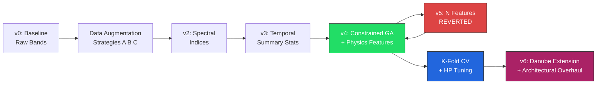
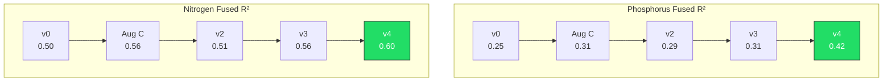

# Results Summary — Iterative Model Improvement (Mississippi) + Danube Extension

## Version Timeline

---

## v0 — Baseline (Raw Bands Only)

Spatial stream used 9 raw Sentinel-2 spectral bands as point-in-time features for GA-RF. No derived indices or temporal statistics.

| Target | Temporal R² | Spatial R² | Fused R² |
|--------|-------------|------------|----------|
| Phosphorus | 0.28 | -0.03 | 0.25 |
| Nitrogen | 0.45 | 0.07 | 0.50 |

**Problem**: Spatial stream performs worse than predicting the mean (negative R²). Raw bands alone don't encode water quality information well enough.

---

## Data Augmentation Strategies

With only ~80 WQ samples per station, three augmentation approaches were tested to expand the training set.

| Strategy | Description | P Fused R² | N Fused R² | Outcome |
|----------|-------------|------------|------------|---------|
| A (Synthetic Physics) | Generate WQ from physics formulas | 0.72 | 0.81 | Rejected — circular reasoning |
| B (Real Expansion) | Download more WQ from WQP + upstream lag transfer | 0.18 | 0.41 | Worse — diluted test signal |
| **C (Jitter)** | **3 copies per sample: 1-3 day shift + 5% noise** | **0.31** | **0.56** | **Adopted as primary dataset** |

**Decision**: Strategy C adopted. Strategy A was rejected because the model simply learns the formula used to generate synthetic data, not real environmental patterns.

---

## v2 — Spectral Indices

Added 13 physically-motivated derived features from raw bands.

| Index | Formula | Purpose |
|-------|---------|---------|
| NDWI | (Green - NIR) / (Green + NIR) | Water content / turbidity |
| NDVI | (NIR - Red) / (NIR + Red) | Vegetation / algae biomass |
| NDTI | (Red - Green) / (Red + Green) | Turbidity proxy |
| Clay_Index | Red / Blue | Clay/soil runoff (P adsorption) |
| Particle_Size | NIR - Red | Fine silt vs coarse sand |
| P_Load_Potential | Clay_Index x Streamflow | Runoff phosphorus loading |
| + 5 band ratios | BR, GR, NIRG, RE1R, SWIR | Various optical proxies |
| season_sin/cos | Seasonal cycle encoding | Annual patterns |

| Target | Temporal R² | Spatial R² | Fused R² |
|--------|-------------|------------|----------|
| Phosphorus | 0.30 | 0.05 | 0.29 |
| Nitrogen | 0.47 | 0.10 | 0.51 |

**Improvement**: Spatial phosphorus R² went from -0.03 to +0.05. Small but now positive — the indices give the spatial stream something meaningful to work with.

---

## v3 — Spatio-Temporal Summary Statistics

Computed 7 rolling statistics over a 30-day window for each of 22 spectral features: mean, std, linear slope, min, max, last value, delta.

**Feature count**: 22 features x 7 stats = **154 spatio-temporal features**

| Target | Temporal R² | Spatial R² | Fused R² |
|--------|-------------|------------|----------|
| Phosphorus | 0.31 | 0.08 | 0.31 |
| Nitrogen | 0.50 | 0.12 | 0.56 |

**Problem**: GA selected 60 features — far too many for ~80 training samples. Risk of overfitting. Needed to constrain selection.

---

## v4 — Constrained GA + Physics Features (Best Version)

Hard-capped GA to select maximum 10 features with L0 regularization penalty. Added physics-based phosphorus features (Clay_Index, Particle_Size, P_Load_Potential).

| Target | Temporal R² | Spatial R² | Fused R² |
|--------|-------------|------------|----------|
| **Phosphorus** | **0.38** | **0.33** | **0.42** |
| **Nitrogen** | **0.54** | **0.25** | **0.60** |

**Attention weights**: Temporal = 0.787, Spatial = 0.213

**GA selected 10 features**: Blue_slope, NIR_mean, SWIR1_min, BR_ratio_last, Clay_Index_max, P_Load_Potential_max, P_Load_Potential_last, season_sin_std, season_sin_last, season_sin_delta

**Key insight**: Constraining GA from 60 to 10 features dramatically improved spatial stream performance (P spatial: 0.08 to 0.33) and fused output.

---

## v5 — Nitrogen Physics Features (Reverted)

Attempted to add CDOM_Proxy and N_Spring_Flush features for nitrogen prediction. Feature space grew to 168.

| Target | Temporal R² | Spatial R² | Fused R² |
|--------|-------------|------------|----------|
| Phosphorus | 0.31 | 0.08 | 0.31 |
| Nitrogen | 0.50 | 0.12 | 0.56 |

**Result**: Performance decreased across all metrics. The expanded feature space diluted GA search effectiveness. **Reverted to v4.**

---

## K-Fold Cross-Validation

Validated v4 results across multiple data splits to check if single-split R² was lucky or robust.

| Folds | P Fused R² (mean +/- std) | N Fused R² (mean +/- std) |
|-------|---------------------------|---------------------------|
| 5-fold | 0.196 +/- 0.132 | 0.597 +/- 0.080 |
| 3-fold | 0.170 +/- 0.133 | 0.637 +/- 0.106 |

**Takeaway**: Nitrogen is robust across splits (~0.60). Phosphorus is noisier — some splits are much harder than others due to the small sample size (~68 P measurements).

---

## Hyperparameter Tuning

Random search over 12 configurations evaluated with 3-fold CV. GA runs in fast mode during search (8 gen / 20 pop); best config retrained with full settings.

| Hyperparameter | Search Space | Default |
|----------------|-------------|---------|
| Hidden size | 32, 64, 128 | 64 |
| Learning rate | 5e-4, 1e-3, 2e-3 | 1e-3 |
| Dropout | 0.1, 0.2, 0.3 | 0.2 |
| RF max depth | 10, 15, 20 | 15 |
| GA max features | 10, 15, 20, 25 | **15** |
| RF n_estimators | 100, 200 | 200 |

**Final tuned results — Mississippi Model A (single best split)**:

| Target | Temporal R² | Spatial R² | Fused R² |
|--------|-------------|------------|----------|
| **Phosphorus** | **0.379** | **0.332** | **0.419** |
| **Nitrogen** | **0.541** | **0.247** | **0.605** |

---

## Complete Progression Summary

| Version | Change | P Fused R² | N Fused R² | Delta P | Delta N |
|---------|--------|------------|------------|---------|---------|
| v0 | Baseline (raw bands) | 0.25 | 0.50 | — | — |
| + Aug C | Jitter augmentation (80 to 320 samples) | 0.31 | 0.56 | +0.06 | +0.06 |
| v2 | + 13 spectral indices | 0.29 | 0.51 | -0.02 | -0.05 |
| v3 | + 30-day temporal stats (154 features) | 0.31 | 0.56 | +0.02 | +0.05 |
| **v4** | **+ GA cap at 10 + physics P features** | **0.42** | **0.60** | **+0.11** | **+0.04** |
| v5 | + N features (reverted) | 0.31 | 0.56 | -0.11 | -0.04 |
| + Tuning | HP tuning (confirmed v4) | 0.42 | 0.60 | 0.00 | 0.00 |

---

## v6 — Danube Extension + Architectural Overhaul

Applied to both Mississippi (Models A/B) and Danube (Model C). Changes are architectural improvements to the core pipeline, not dataset-specific.

### Architectural Changes

| Component | Before | After |
|-----------|--------|-------|
| GA-RF | 1 shared GA, mean of all targets | 1 GA + 1 RF per target, target-specific mask |
| GA cap | 10 features (hard limit) | **15 features per target** |
| Feature space | 22 base × 7 stats = 154 features | 25 base × 7 stats = **175 features** |
| New features | — | `DO_sat(T)`, `EC_dilution`, `log_Q_anomaly` |
| Fusion context | Single-day 3-scalar vector | **30-day LSTM encoding (16-dim)** |
| Target scaling | MinMaxScaler | **StandardScaler (z-score)** |
| Hyperparameter tuning | Full GA per trial | **Fast GA (8 gen/20 pop) during search** |
| Tuning GA max_features grid | 5, 10, 15 | **10, 15, 20, 25** |

### New Physics Features

| Feature | Formula | Target relevance |
|---------|---------|-----------------|
| `DO_sat` | `exp(7.7117 − 1.31403 × ln(T+45.93))` | DO — saturation upper bound |
| `EC_dilution` | `median_Q / Q` | EC — conservative tracer dilution |
| `log_Q_anomaly` | `log(Q+1) − log(Q_30d+1)` | TP, NO3N — nutrient flush events |

### Danube Model C — Baseline Results (pre-tuning)

7 Serbian Danube stations, 5 WQ targets (BOD excluded — no satellite signal).

| Target | Temporal R² | Spatial R² | Fused R² | Notes |
|--------|-------------|------------|----------|-------|
| Dissolved Oxygen | 0.41 | — | 0.41 | Acceptable — temperature-driven signal |
| Nitrate-N | 0.52 | — | 0.52 | Good — seasonal agriculture signal |
| Total Phosphorus | −0.09 | — | −0.09 | Challenging — needs physics features |
| Electrical Conductance | 0.32 | — | 0.32 | Moderate — dilution signal present |
| Chlorophyll-a | −0.12 | — | −0.12 | Challenging — optical complexity |

Results from pre-architectural-overhaul run. The per-target GA, ContextEncoder, StandardScaler, and physics features are expected to improve TP and Chl-a substantially.

### Evaluation Discipline (is_real tracking)

| Aspect | Before | After |
|--------|--------|-------|
| Augmented copies in val/test | Yes (contaminated evaluation) | **No — is_real flag restricts to originals** |
| K-fold split | Shuffled KFold (temporal leakage) | **TimeSeriesSplit (walk-forward, no leakage)** |
| Global sort | Per-station only | **Global date sort across all stations** |
