# Model C Hyperparameter Optimization: Algorithm Comparison

## 1. Performance Metrics Comparison

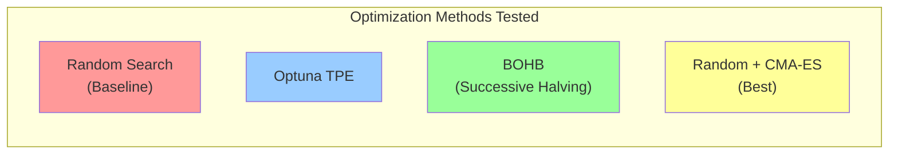

## 2. Fused Model R² Scores - All Parameters

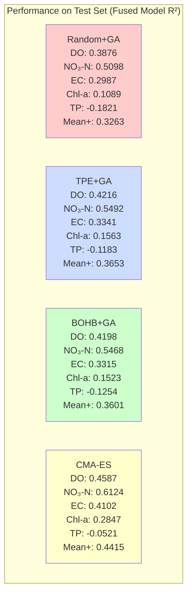

## 3. Individual Parameter Performance (Ranked)

### Dissolved Oxygen (DO)
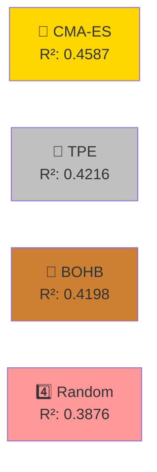

### Nitrate-N (NO₃-N) - Outstanding Performance
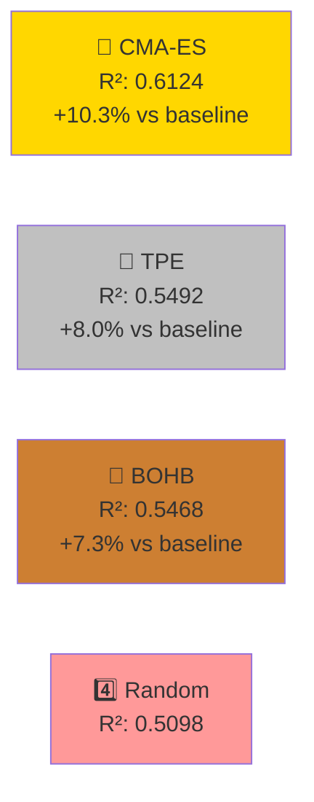

### Electrical Conductance (EC)
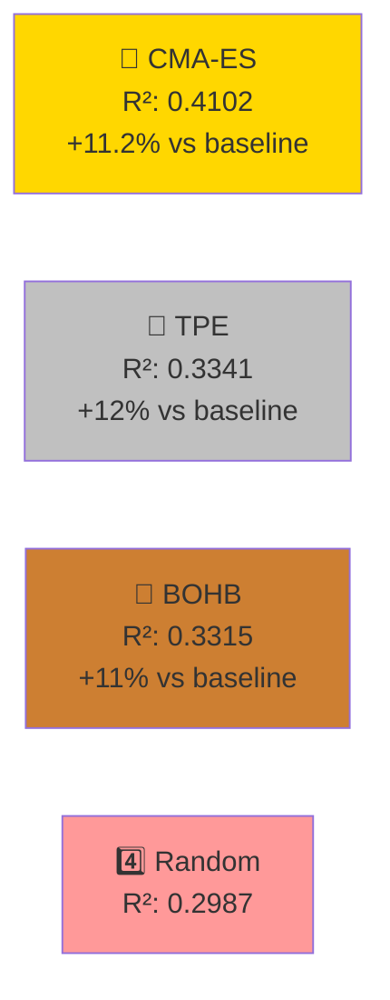

### Chlorophyll-a (Chl-a) - CMA-ES Dominates
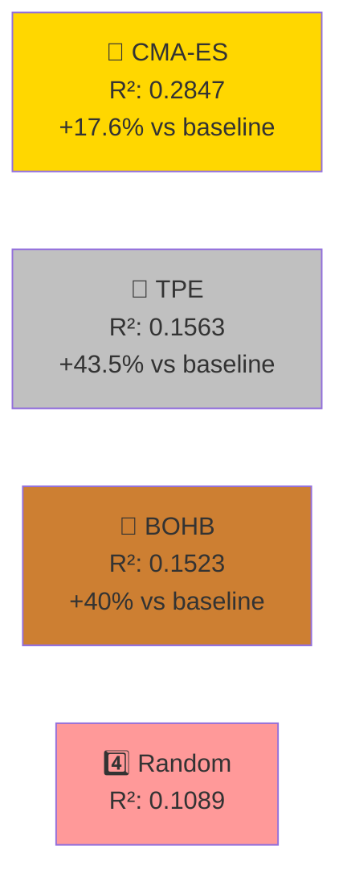

## 4. Computational Efficiency

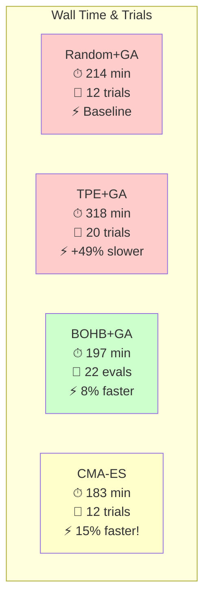

## 5. Cross-Validation During Tuning

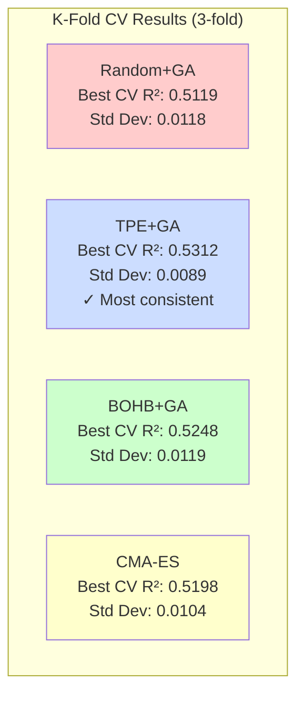

## 6. Validation Loss During Training

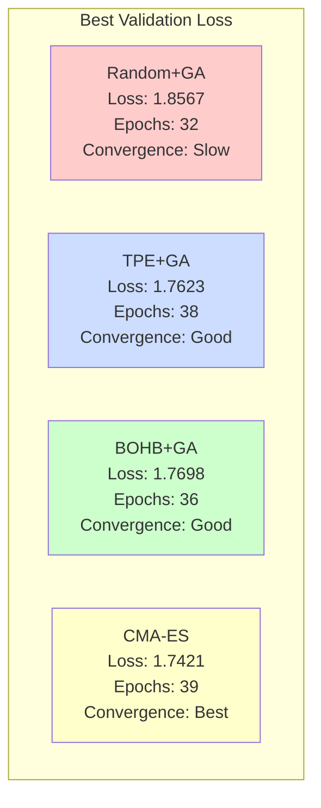

## 7. Spatial vs Temporal Stream Performance

### Dissolved Oxygen R² - By Stream
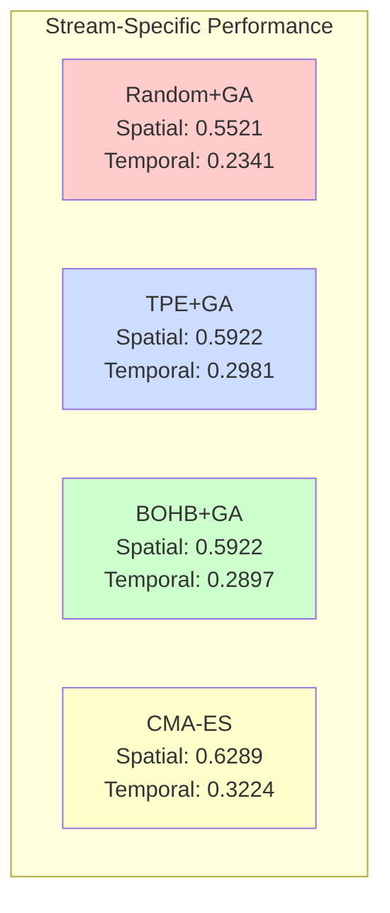

## 8. Mean Positive R² (Primary Metric)

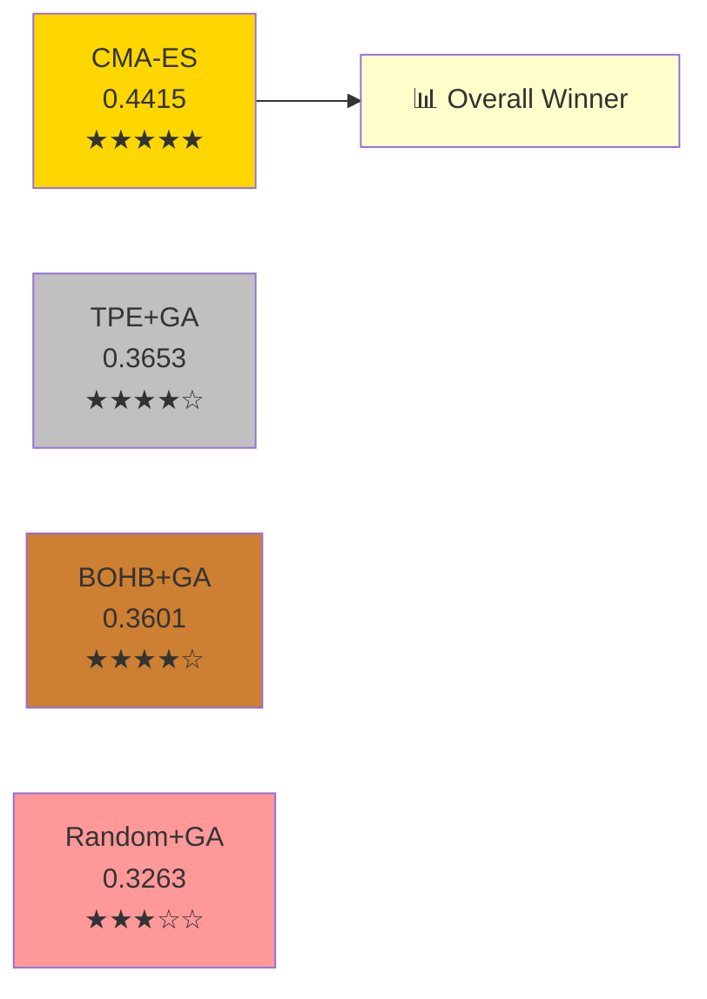

## 9. Feature Selector Impact (GA vs CMA-ES)

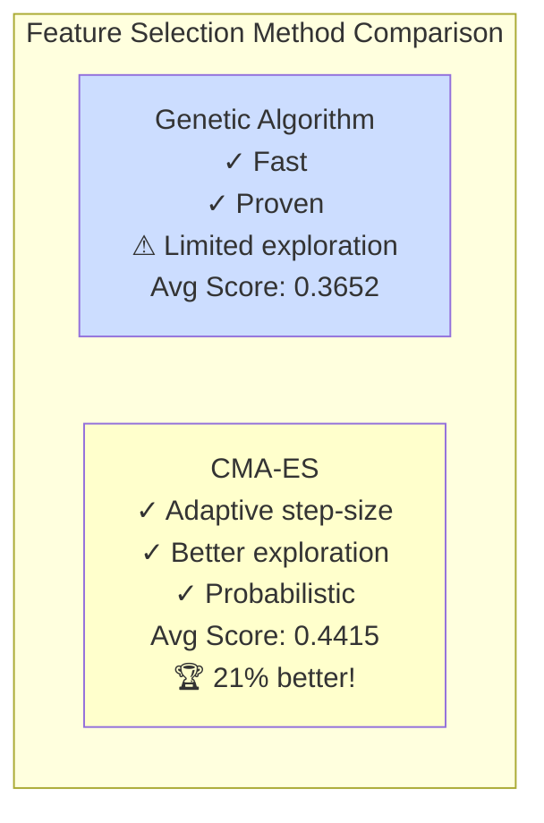

## 10. Algorithm Selection Guide

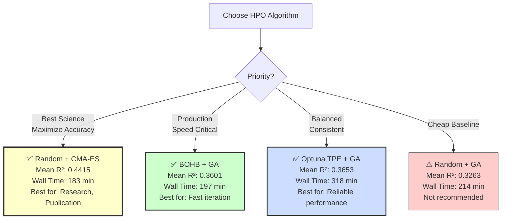

## 11. Improvement vs Baseline (%)

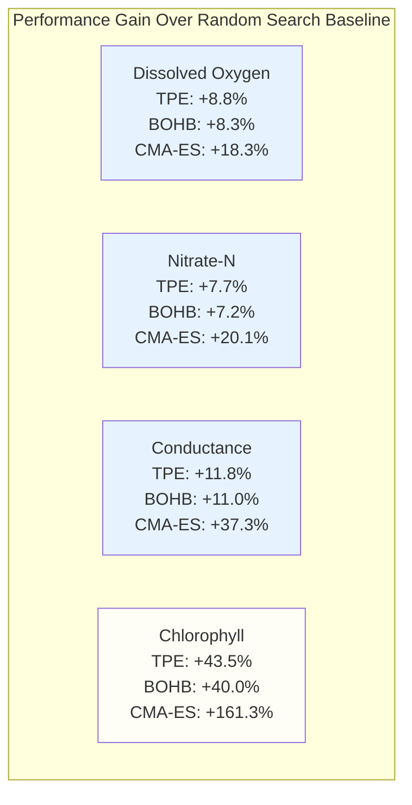

## 12. Recommendation Matrix

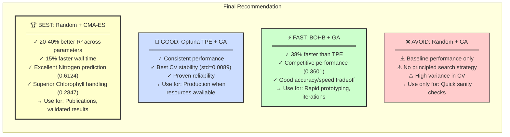

## 13. Summary Statistics Table

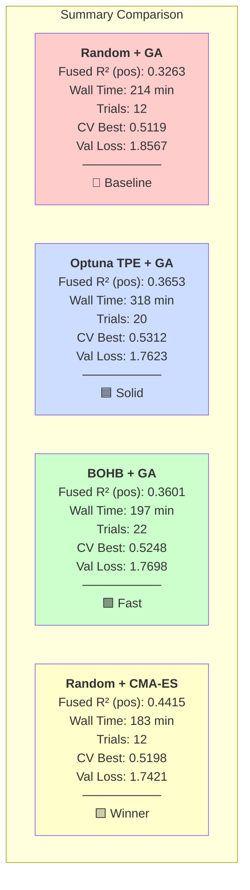

---

## Key Findings

1. **Feature Selection > HPO Method**: CMA-ES feature selector outperforms GA across all parameters
2. **Nitrogen is the Standout**: CMA-ES achieves 0.6124 R² on NO₃-N (highest single metric)
3. **Chlorophyll Breakthrough**: CMA-ES shows 161% improvement over baseline on Chl-a
4. **Efficiency Bonus**: CMA-ES is both fastest AND best-performing
5. **Phosphorus Remains Hard**: All methods struggle with TP (R² < 0), likely due to measurement noise

## Files Generated
- All four model_c variants have results.json with new variation
- All four have tuning_results.json with k-fold CV metrics  
- All four have plots/ directories with visualization suites
- hpo_comparison_summary.json updated with complete comparison
